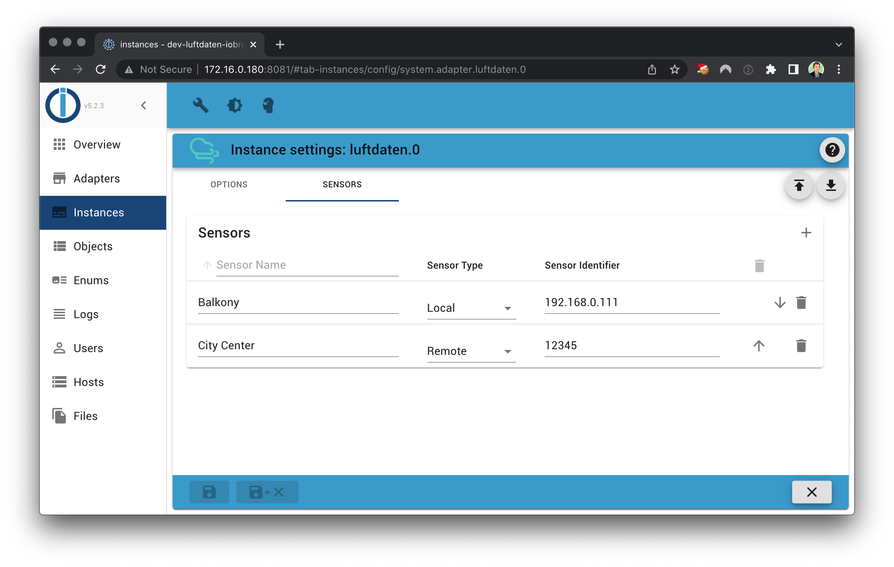

# ioBroker.luftdaten

## Configuration

### Local

1. Build your own sensor and add it to your local network
2. Create a new instance of the adapter
3. Type a custom name in the first table column
4. Choose "Local" as type (second column)
5. Fill the IP address or hostname of the sensor in the third column
6. Save the settings

Wait some seconds until the cronjob collects the data for the first time.

*Feel free to change the schedule settings in the instances tab (default: every 30 minutes).*

### Remote

1. Choose one of the sensors on the official map: [deutschland.maps.sensor.community](https://deutschland.maps.sensor.community/)
2. Click on the sensor and copy the ID (#XXXXX)
3. Create a new instance of the adapter
4. Type a custom name in the first table column
5. Choose "Remote" as type (second column)
6. Fill the ID of the sensor in the third column (without #)
7. Save the settings

Wait some seconds until the cronjob collects the data for the first time.

*Feel free to change the schedule settings in the instances tab (default: every 30 minutes).*

### Example

